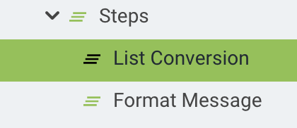
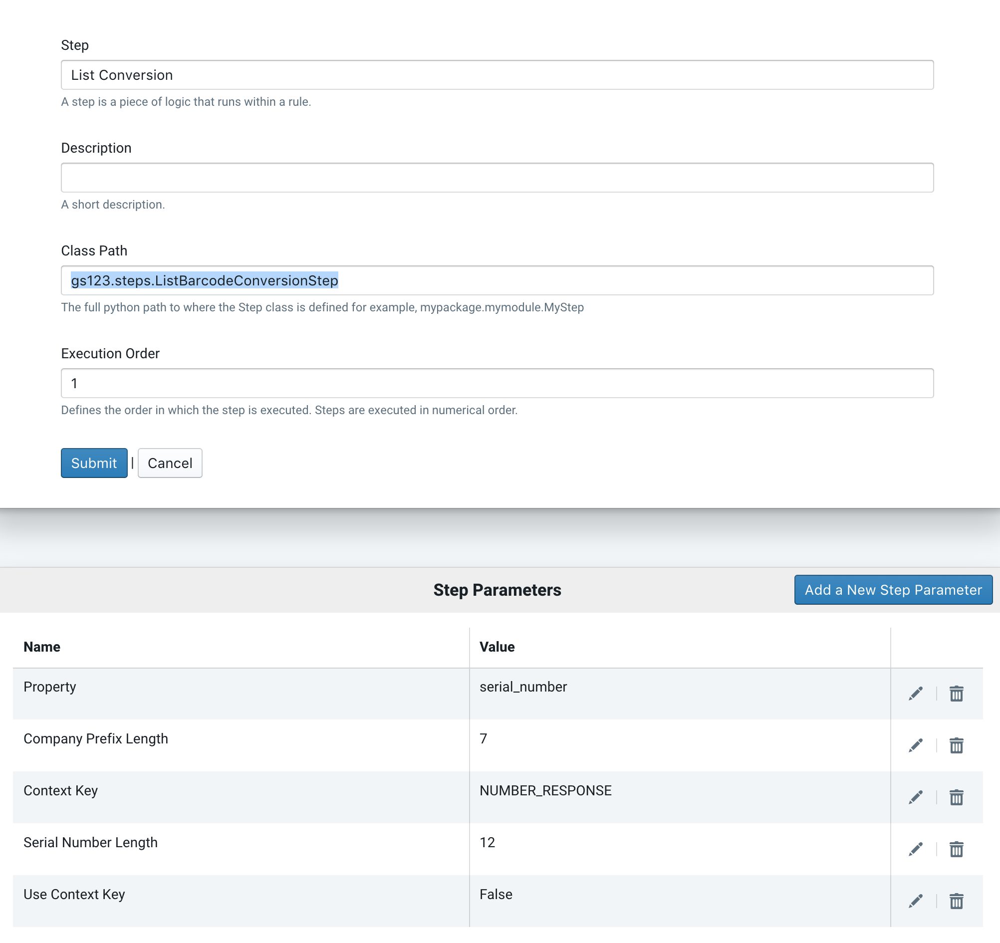
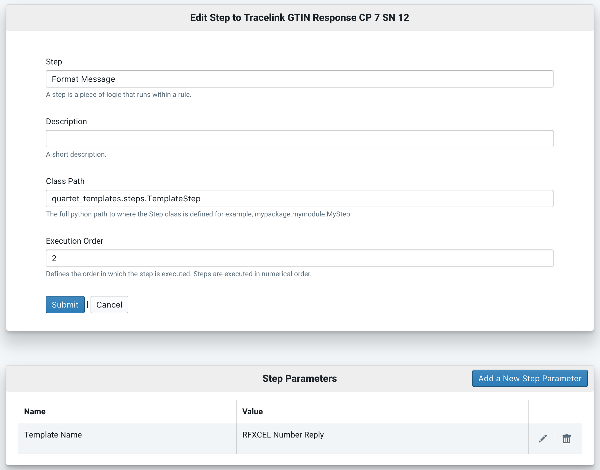
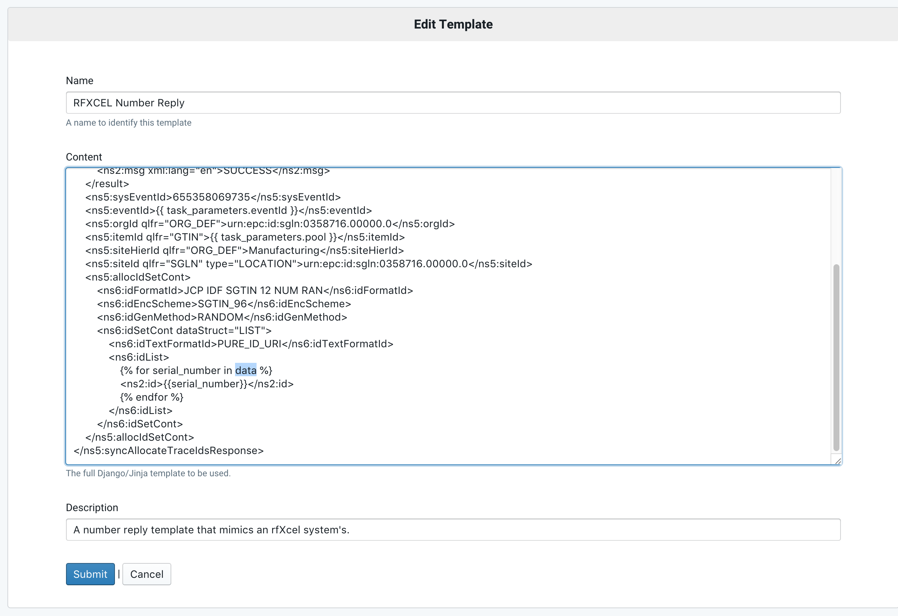

The List Based Request Lifecycle
================================

Understanding the lifecyle of a list-based request will help with your
overall understanding of both how to deploy the list based flavorpack and
how to extend or develop around it.

SerialBox Looks Up The Pool
---------------------------

The SerialBox :code:`Allocate API` handles the initial HTTP request by first
looking for the pool in the database.  The pool is supplied in the request
via one of the URL path variables.  (For more on this see the Allocate API
documentation.)

The Generator is Acquired
-------------------------

The currently active *Region* within the pool returned will be queried
for its SerialBox *Generator* class.  Each type of region in SerialBox has
a generator class that is responsible for generating whatever type of
serial number or output that a given region will produce.  SerialBox will
take the currently active region in the current pool and ask it for its
*Generator* class.  The list-based Generator is located at
:code:`list_based_flavorpack.generators.list_based.ListBasedGenerator`.

The Processing Class is Created
-------------------------------

The list based flavorpack returns a generator that uses dynamically
acquired *processing class*.  This processing class is configured during
setup by providing a class path to use to handle list-based processing.
The configuration of this class path is in the list-based region model
defined in the :code:`list_based_flavorpack.models` python module.

If you look at the :code:`list_based_flavorpack.models.ListBasedRegion` you
will see a char field defined called :code:`processing_class_path`.  This
is the value that is used to dynamically create a processing class.  Why is
this being done?  Well, the most common use for a list-based region is to
supply applications with serial numbers that originated in another system.
By dynamically creating a processing class, this allows implementers to
extend the base functionality of the generator by supplying custom
processing classes that help generate numbers.

Currently, the only processing class available for list-based requests is the
:code:`list_based_flavorpack.processing_classes.third_party_processing.processing.ThirdPartyProcessingClass`

SerialBox Calls The Generate Function
-------------------------------------

Once the Generator has instantiated its processing class and the Generator has been returned
to SerialBox, SerialBox calls the *Generate* function on the Generator.
The :code:`ListBasedGenerator` will then call the :code:`get_items` function
on the *processing class* by passing in the currently active region and the size of the
current request.  The result of this call will be passed along to the base
:code:`Generator` class defined by SerialBox.  See the actual code below:

.. code-block:: python

    class ListBasedGenerator(Generator):
        '''
        Generates a list of numbers (or anything else located in source)
        '''
        def generate(self, request, response, region, size):
            '''
            Executes an instance of the processing class and returns a list.
            '''
            processing_class = import_processing_class(region)
            return self.set_number_list(response, processing_class().get_items(region, size))

        def get_settings_module(self):
            return settings

Preprocessing Rules of the ProcessingClass are Executed
-------------------------------------------------------

A generator specifies its settings module (optionally) where Pre and Post
processing classes are defined.  For the list-based flavorpack the settings
are defined in *list_based_flavorpack_settings.py*.  The default pre and post
processing classes are defined as follows and can be overriden by defining
them in a standard django settings module.

.. code-block:: python

    from django.conf import settings

    GENERATOR_PREPROCESSING_RULES = getattr(
        settings,
        'GENERATOR_PREPROCESSING_RULES',
        {
            'list_based_flavorpack.generators.list_based.ListBasedGenerator': [
                'serialbox.rules.limits.ActiveRule',
                'list_based_flavorpack.generators.list_based.ListBasedPreprocessRule',
                'serialbox.rules.limits.RequestThresholdLimitRule',
            ]
        })

    GENERATOR_POSTPROCESSING_RULES = getattr(
        settings,
        'GENERATOR_POSTPROCESSING_RULES',
        {'list_based_flavorpack.generators.list_based.ListBasedGenerator': [
                'serialbox.rules.limits.ActiveRule',
                'list_based_flavorpack.generators.list_based.ListBasedPostprocessRule',
                'serialbox.rules.limits.RequestThresholdLimitRule',
            ]})

During any SerialBox request process, any preprocessing rules defined in the
settings will be executed before the request is passed to the region and pool
that is currently part of the request.  As you can see above, the following
happens when a list-based request comes in:

#.  The serialbox standard ActiveRule is executed to make sure that
    the current pool and region being queried is marked as active.
#.  The ListBasedPreprocessingRule, which allows a Processing Class to explicitly
    define rules to execute as part of its implementation, will execute any pre processing
    rules that the processing class returns from its :code:`get_pre_processing_rules`
    function.  In this case, the :code:`ThirdPartyProcessingClass` reuturns
    two pre-processing rules: the :code:`list_based_flavorpack.processing_classes.third_party_processing.rules.ValidNumberDirectory` and
    :code:`list_based_flavorpack.processing_classes.third_party_processing.rules.SufficientNumbersStorage`
    rules.
#.  The ValidNumberDirectory rule is executed.  This checks to make sure the
    directory where numbers are stored exists and is accessible to SerialBox.
#.  The SufficientNumbersStorage rule is called- this makes sure
    that there are enough numbers in the currently active region to satisfy the request.
    If there are not enough numbers then this rule will try to fetch more
    numbers from an external system by executing a rule defined in the current
    Region that contains the logic to retrieve numbers...more on this soon.
#.  The RequestThresholdLimitRule will make sure that, even after all of the
    above, that enough numbers are available to satisfy the final request (sometimes
    the external system does not have enough numbers).

If Necessary, the Rule Engine is Invoked to Replenish Numbers
-------------------------------------------------------------

If a request is made to the list based flavor pack and there are not enough
numbers, the :code:`list_based_flavorpack.processing_classes.third_party_processing.rules.SufficientNumbersStorage`
will use a number of configured properties of the currently active list-based
region to execute a request to an external system for new numbers.  The following steps occur:

#.  The Rule to execute is looked up from the region's *rule* property.
#.  A template to use as a request to be sent to the external system is looked up
    via the region's *template* property.
#.  The template is rendered using the parameters supplied in the region's *Processing Parameters*
    collection.
#.  The rule engine is invoked (with the *run_immediately* flags set to True) with the contents of
    rendered template being the passed in as the data,
    the rule name being the rule name defined in the region, and the task_parameters
    with a sigle task parameter that contains the machine name of the current region.

The Rule Engine Processes the Request
-------------------------------------

In order to illustrate how the next steps happen we will use a TraceLink request
as an example.  TraceLink is a system much like QU4RTET but with more limited capabilities.
In any event, it serves as a fine example of a typical external system.

A typical number request processing rule has two steps:

#.  Ask the system for numbers and handle any exceptions/errors.
#.  Store the numbers returned for use by SerialBox.

If the rule defined in the current region was a tracelink rule, the following would happen:

The :code:`list_based_flavorpack.steps.NumberRequestTransportStep` will look in the
rule context for the name of the region to use to formulate a request.  It will then
use that region to get the *EndPoint* to use for the request (URL) and the authentication
credentials to use (if any).  It will then send the payload (the rendered template)
to the endpoint defined in the region using the credentials defined in the region's
endpoint property.  If all goes well, the external system will return a bunch of
data which will then be passed to the next step via the :code:`NUMBER_RESPONSE`
rule context parameter.

There is another QU4RTET module named :code:`third_party_flavors`, where *Steps* for handling
number range responses is defined for both TraceLink and rfXcel systems.  In this example
we will assume that the next step in the rule is defined as
:code:`third_party_flavors.tracelink_number_response_step.TracelinkNumberResponseParserStep`.
The *TracelinkNumberResponseParserStep* will look in the rule context for anything in the
:code:`NUMBER_RESPONSE` key.  If it finds it, it will parse the response and store the
response in a flat file defined by the region's *directory_path* and *file_id*
fields.

The Generator Responds With a List of Numbers
---------------------------------------------

At this point, the generator has supplied SerialBox with a list of numbers to
use (as long as no exceptions took place during the request) and the Pool is now
ready to send it back to the requestor.

The Pool Executes its Response Rule
-----------------------------------

Now that the system has a bunch of numbers to return to the requesting system,
it has one last job to do: format the response and/or transform some of the numbers
to formats that the requesting system can understand.  This process, like the one above,
is achieved through using the QU4RTET rule engine via assigning a rule
to the Pool's *Response Rules* collection via the serialbox.models.ResponseRule
foreign key relationship.

No two response rules are the same but a typical response rule does the following:

#.  Converts the numbers to a format to be used in the response.  For example, converts URNs to
    barcodes.
#.  Takes the numbers and renders them using a Template.

For example:

As you can see above there are two steps.

If you look above, you can see that the system is configured to use the
:code:`gs123.steps.ListBarcodeConversionStep` to convert the numbers being
returned from barcodes into URN values.  This step needs some information
in order to convert everything accurately and you can see in the *Step Parameters*
that a number of things must be provided.  For example, you can see that the
:code:`Property` parameter is configured for :code:`serial_number`.  This
is telling the step to use non-padded serial-number values from barcodes. If you
wanted any serial number values returned from barcodes with their padding intact
you could specify :code:`padded_serial_number`, for example.
Conversely, if you wanted to convert
URN values to barcode values, you would use the :code:`gs123.steps.ListURNConversionStep`.
The decision you need to make with regards to this depends on what the external
source system returns and what the requesting system expects. For example,
you may ask a tracelink system for serialnumbers and get a bunch of barcodes but
you may have an optel system asking SerialBox for URN values.  At some point,
the values returned from tracelink must be converted to values that the other
system can understand (for example).

Now finally, you apply the list of numbers to a given template using (typically)
the :code:`quartet_templates.steps.TemplateStep`.  As you can see above you
supply a *Template Name* *Step Parameter* with the name of a QU4RTET template
to use and the reply will be rendered.  The template engine used is Jinja 2
and the serial numbers are passed into the template context as the :code:`data`
variable.

As you can see above, the template renders the list of serial numbers in the
rule data stream to the template.  This is ultimately, what gets returned
to the requesting system.

The Data is Returned to the Requestor
-------------------------------------

Once all of the above steps have occured, the data is returned to the requesting
system.

